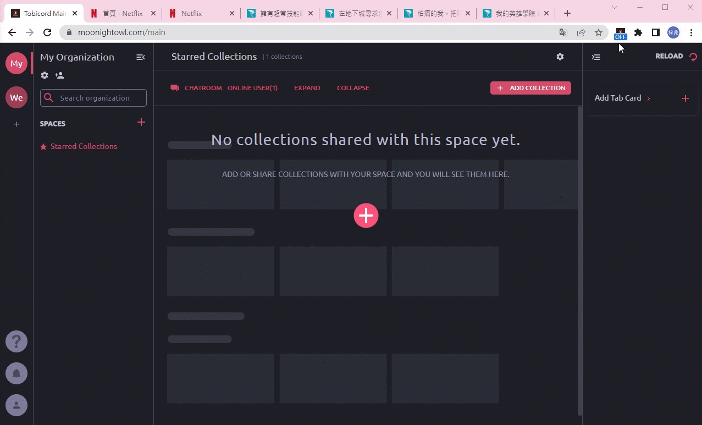

# Tobicord

  

   

Tobicord provides individuals and groups with browser tab management, classification, and editing. Tabs can be easily and quickly dragged to different collections and save in the online database. Tobicord also provides multi-user collaborative editing and group chat rooms, making it easier for teams to communicate and collaborate.

🖥️ Website URL : https://moonightowl.com/

Test account and password : test@gmail.com / 123456

# Demo

### Better Than Bookmarks

-   Get all browser tabs by extension and easily organize、save、edit browser tabs by drag and drop. Users can create a URL and share their bookmark collection with others.

  

   

### Team-

  

   
